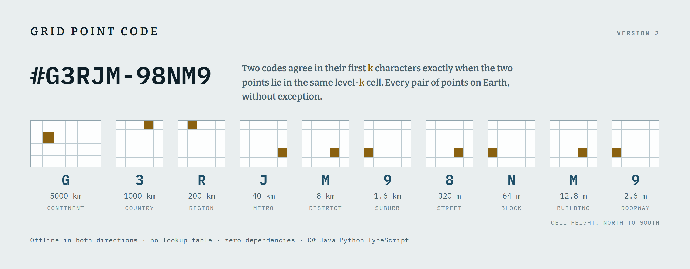

# Grid Point Code (GPC)

[](https://github.com/octopranav/Grid-Point-Code/actions/workflows/ci.yml)
[](https://central.sonatype.com/artifact/ca.pranavpatel.algo/gridpointcode)
[](https://www.nuget.org/packages/Ca.Pranavpatel.Algo.GridPointCode)
[](https://www.npmjs.com/package/@pranavpatel.ca/algo-gridpointcode)
[](https://pypi.org/project/gridpointcode-algo-pranavpatel-ca/)

<picture>
  <source media="(prefers-color-scheme: dark)" srcset="docs/hero-dark.png">
  
</picture>

**Grid Point Code** names one cell of a fixed grid over the Earth with a
ten-character code. Conversion runs offline in both directions and is a few
lines of integer arithmetic, with no lookup table and no network.

```
43.65000, -79.38000   ->   #G3RJM-98NM9
```

## Who this is for

**If you just need to tell somebody where something is**, a code is ten
characters and names any spot on Earth to about three metres. A gate in a field,
a stall in a market, the door round the back of a building, the bench you agreed
to meet at. It works where there is no street number and no street name, it
needs no app and no account, and neither end needs a signal to turn it back into
a point on a map.

**If you write software**, conversion is a few lines of integer arithmetic in
both directions. No service to call, no API key, no rate limit, no data file to
ship, and no third-party dependency in any of the four ports. What you compute
on a phone in a basement is what you compute on a server.

**If you keep locations in a database**, the guarantee below does the work an
extra index usually does. Codes sort geographically as plain strings, so
`ORDER BY code` is a spatial sort and an ordinary index is a spatial index. A
prefix is a region, so `WHERE code LIKE 'G3RJM%'` means "everything in this
8.0 by 10.7 km cell". And a code fits in six bytes if you would rather store a
number than a string.

**If codes get spoken or written down**, over a radio, down a telephone, onto a
sign or a delivery note, an optional check character catches every
single-character mistake and every swapped pair, and
[Appendix D](SPEC.md#appendix-d--sharing-a-code-non-normative) covers reading
one aloud.

**If you work on small hardware or at scale**, there is no lookup table and no
state to keep. The same ten-step loop fits in a microcontroller, a database
function, or a batch over a billion rows.

### What you would reach for

| You want to | Use |
| --- | --- |
| Share one exact spot | The full code, `#G3RJM-98NM9` |
| Say it aloud, or have it written down | The check form, `#G3RJM-98NM9*T` |
| Group points by area | The first k characters, `cell` |
| Ask whether a point is in an area | `contains`, which is a string comparison |
| Find what is next door | `neighbours` |
| Store it small, or sort it | The 48-bit integer form |
| Repair a code somebody mistyped | `suggest_corrections` |
| Warn before a code goes on a sign | `screen` |

Two things worth knowing before you start. A code names a **cell, not a point**,
so it comes back as the centre of a 2.56 by 3.42 m box rather than the exact
coordinate you put in. And a shared prefix proves nearness, but nearness does
not promise a shared prefix. Two points either side of a grid boundary can
share nothing at all. Both are covered under
[Precision and limits](#precision-and-limits).

## The guarantee

> Two codes agree in their first **k** characters **if and only if** the two
> points lie in the same level-**k** cell.

Both directions, for every pair of points on Earth, without exception. That is
containment rather than correlation, and it is a theorem about how the code is
built rather than a tendency measured over samples: it is proved in
[section 10 of the specification](SPEC.md#10-the-locality-guarantee) and
re-checked over 1,200,000 pairs on every push.

Everything below follows from that one property.

| Because a shared prefix **is** a shared cell | |
| --- | --- |
| A prefix is a region identifier | ten nested scales, continent down to doorway, with nothing to mint and nothing extra to store |
| The prefix test **is** the containment test | `contains` is a string comparison, with no geometry, no tolerance, no special case at a boundary |
| The alphabet is ASCII-ascending | `ORDER BY code` is a spatial sort, and an ordinary string index is a spatial index |
| Cells nest exactly | neighbours, cell sizes, the short form and typo correction are all integer arithmetic on the grid |

### What a prefix is worth

Every character narrows the cell by a factor of five on each axis. All ten
levels, with the cell each prefix length names:

| Shared characters | Cell, north-south | Cell, east-west | Roughly | You could say |
| ---: | ---: | ---: | --- | --- |
| 1 | 5,000.9 km | 6,679.2 km | Continent | "the same continent" |
| 2 | 1,000.2 km | 1,335.8 km | Country | "the same country, or one next to it" |
| 3 | 200.0 km | 267.2 km | Region | "the same region" |
| 4 | 40.0 km | 53.4 km | Metropolitan area | "the same city and its surroundings" |
| 5 | 8.0 km | 10.7 km | District | "the same part of town" |
| 6 | 1.6 km | 2.1 km | Suburb | "walking distance" |
| 7 | 320.1 m | 427.5 m | Street | "the same street" |
| 8 | 64.0 m | 85.5 m | City block | "the same block" |
| 9 | 12.8 m | 17.1 m | Building | "the same building" |
| 10 | 2.6 m | 3.4 m | Doorway | "the same doorway" |

Read it either way. Downward, it is how much precision each character buys.
Upward, it is what you may safely tell somebody from a shared prefix alone: four
characters in common already means one metropolitan area, and no pair of points
on Earth can share four characters and be further apart than that cell.

North-south figures hold everywhere. East-west figures shrink with the cosine of
latitude, so a cell is squarer at 41.5 degrees and narrower towards the poles.
[Section 3](SPEC.md#3-the-grid) has the degree spans behind each row.

## Code structure

* **Format**: `#XXXXX-XXXXX`, ten characters, the same length everywhere
* **Alphabet**: `0123456789CDFGHJKLMNPRTWX`, 25 symbols, no vowels, digits
  first so that the ASCII order is the spatial order
* **Cell**: 2.56 m north to south by 3.42 m east to west at the equator
* **No dependencies**: nothing third-party in any of the four ports
* **Reads version 1 codes**: every code ever issued still resolves

## Precision and limits

* **A code names a cell, not a point.** `decode` returns the centre of that
  cell, so a coordinate carrying more precision than the 2.56 m cell does not
  come back unchanged. Encoding what you decoded always returns the same code,
  and `decode_to_area` hands back the cell's four boundaries when the box
  matters more than the centre.
* **A shared prefix proves proximity; proximity does not promise a shared
  prefix.** Level-1 boundaries lie on the equator, on 45 degrees north and
  south, and on every 60th meridian, and two points a few metres apart across
  one of those seams share nothing at all. Of random pairs 100 m apart, 91.45 %
  share at least six characters and 0.36 % share fewer than four.
  [Section 16](SPEC.md#16-seams) maps the seams and works through the examples.
* **Nearly 29 % of single-character typos** produce a location in the right
  region and the wrong place. Show the decoded point on a map, or check it
  against something the reader recognises, before acting on it. No amount of
  format design removes that; confirmation does.

## Which form to share

| Where it is going | Share | Why |
| --- | --- | --- |
| A share button, a message, a record, a label | `#G3RJM-98NM9` | complete on its own |
| Voice, radio, paper, anything dictated | `#G3RJM-98NM9*T` | one character buys detection |
| A sign in one place, two people standing in it | `98NM9` | only resolves near the point |
| A database key, a QR or NFC payload | six bytes | not for a person to read |

The ten characters are the form of record, and they are what a share button
emits. `with_check` returns the check form in one call; its one extra character
detects every single-character error and every adjacent transposition, which
are the two mistakes a person makes, so it earns its place wherever a code will
be read aloud or written down.

The short form is the one to be careful with. Five characters resolve only
against a reference near the true point: right for a sign at the entrance to a
village, wrong behind a share button, which cannot know where the far end will
be standing. Out of range it does not fail; it returns a plausible location 8
or 10 km away.

[Appendix D](SPEC.md#appendix-d--sharing-a-code-non-normative) covers the rest,
including how to read a code out loud given that `C`, `D`, `G`, `P`, `T` and
the digit `3` all rhyme.

---

## Requirements

| Port | Requires | Full API |
| --- | --- | --- |
| Python | 3.9 or later | [python/README.md](python/README.md) |
| TypeScript | Node.js 22 or later | [typescript/README.md](typescript/README.md) |
| C# | .NET 9.0 or .NET 10.0 | [csharp/README.md](csharp/README.md) |
| Java | Java 21 or later | [java/README.md](java/README.md) |

None of the four ports has a third-party dependency. Each port's own README
carries the complete API for that language, including the typed error and the
reason codes a caller can branch on rather than matching on message text.

## Installation

### Python

```bash
pip install gridpointcode-algo-pranavpatel-ca
```

### TypeScript (Node.js)

```bash
npm i @pranavpatel.ca/algo-gridpointcode
```

### C# (.NET)

Add the project reference via NuGet:

```bash
dotnet add package Ca.Pranavpatel.Algo.GridPointCode
```

### Java (Maven)

Add the following to your `pom.xml`:

```xml
<dependency>
    <groupId>ca.pranavpatel.algo</groupId>
    <artifactId>gridpointcode</artifactId>
    <version>2.0.0</version>
</dependency>
```

---

## Usage Examples

### Python

```python
from gridpointcode_algo_pranavpatel_ca import GPC

# Encode
gpc_code = GPC.encode(43.65000, -79.38000)
print(gpc_code)  # Output: #G3RJM-98NM9

# Decode
lat, lng = GPC.decode("#G3RJM-98NM9")
print(lat, lng)  # 43.650006 -79.380004

# Validate and classify
print(GPC.is_valid("#G3RJM-98NM9"))   # True
print(GPC.classify("XG3RJ98NM9"))     # RESERVED

# Version 1 codes still decode
print(GPC.decode("#FN5G-CDKL-HDC"))   # (43.65, -79.38)
```

---

### TypeScript

```ts
import { GPC } from '@pranavpatel.ca/algo-gridpointcode';

// Encode
const code = GPC.encode(43.65, -79.38);
console.log(code);  // #G3RJM-98NM9

// Decode
const [lat, lng] = GPC.decode('#G3RJM-98NM9');
console.log(lat, lng);  // 43.650006 -79.380004

// Validate and classify
console.log(GPC.isValid('#G3RJM-98NM9'));  // true
console.log(GPC.classify('XG3RJ98NM9'));   // 'RESERVED'

// Version 1 codes still decode
console.log(GPC.decode('#FN5G-CDKL-HDC'));  // [43.65, -79.38]
```

---

### C\#

```csharp
using Ca.Pranavpatel.Algo.GridPointCode;

// Encode
string gpc = GPC.Encode(43.65000, -79.38000);  // Toronto
// Output: #G3RJM-98NM9

// Decode
(double lat, double lng) = GPC.Decode("#G3RJM-98NM9");

// Validate and classify
bool isValid = GPC.IsValid("#G3RJM-98NM9");
CodeClass kind = GPC.Classify("XG3RJ98NM9");  // CodeClass.Reserved

// Version 1 codes still decode
(double v1Lat, double v1Lng) = GPC.Decode("#FN5G-CDKL-HDC");
```

---

### Java

```java
import ca.pranavpatel.algo.gridpointcode.CodeClass;
import ca.pranavpatel.algo.gridpointcode.Coordinates;
import ca.pranavpatel.algo.gridpointcode.GPC;

// Encode
String gpc = GPC.Encode(43.65, -79.38);  // Toronto
// Output: #G3RJM-98NM9

// Decode
Coordinates coords = GPC.Decode("#G3RJM-98NM9");
double lat = coords.Latitude;   // 43.650006
double lng = coords.Longitude;  // -79.380004

// Validate and classify
boolean isValid = GPC.IsValid("#G3RJM-98NM9");
CodeClass kind = GPC.Classify("XG3RJ98NM9");  // CodeClass.RESERVED

// Version 1 codes still decode
Coordinates old = GPC.Decode("#FN5G-CDKL-HDC");
```

---

## The optional check character

A code is ten characters and carries no checksum, because eleven characters
everywhere would be a high price for a problem that only exists once a person is
involved. So the eleventh character is optional, written after a star, and you
add it exactly where the people are:

```python
GPC.with_check("#G3RJM-98NM9")       # '#G3RJM-98NM9*T'
```

**What it buys.** It detects **every single-character error** and **every
transposition of two adjacent characters**, the two mistakes people actually
make when they hear a code, write it down, and type it in later. Verified
exhaustively: over 4,000 random codes, all 1,056,000 possible single-symbol
errors and all 38,389 adjacent transpositions were caught.

**Why that matters here.** Without it, a mistyped code is usually still a valid
code. Nearly 29 % of single-character typos land somewhere plausible in the
right region (the wrong door, the wrong block, sometimes 20 km away), and
nothing in the format objects, because very nearly every ten-character string
over the alphabet names some real cell. The check character is the one mechanism
that says "this is not what was sent" instead of quietly naming the wrong place.

**When to use it.**

| Situation | Add the check character? |
| --- | --- |
| Read aloud, over a radio or a telephone | **Yes** |
| Written by hand, printed on a sign or a delivery note | **Yes** |
| Typed in by a person from anywhere | **Yes** |
| Machine to machine, stored in a record, put in a URL | No, it is not canonical |

**It is never in the way.** The check form is **not canonical**: no port emits
it unless asked, `#G3RJM-98NM9` and `#G3RJM-98NM9*T` denote the same place, and
a reader who drops the star and the character loses only the detection. A code
that arrives with a *wrong* check character is rejected with the reason
`GPC_CHECK` rather than decoded to the wrong place.

```python
GPC.with_check("#G3RJM-98NM9")        # '#G3RJM-98NM9*T', the whole form
GPC.check_character("#G3RJM-98NM9")   # 'T', the character alone
GPC.decode("#G3RJM-98NM9*T")          # (43.650006, -79.380004), check confirmed
GPC.is_valid("#G3RJM-98NM9*Z")        # False -- the check does not hold
```

Reach for `with_check` rather than building the string yourself. By hand it is
three operations and two ways to be quietly wrong: the star dropped, or the
character spliced inside the group separator instead of after it, and neither
mistake is caught by anything, because the result is a string nobody validated.
It recomputes rather than trusting, so a code arriving with a wrong check comes
back with a right one.

[Section 14](SPEC.md#14-the-check-character-optional) specifies it, and
[Appendix D](SPEC.md#appendix-d--sharing-a-code-non-normative) covers saying one
out loud.

---

## Every feature

All of it is in all four ports, under the names below. None of it needs a
network, an account, a key or a data file.

### Converting

| What it does | Python | TypeScript | C# and Java |
| --- | --- | --- | --- |
| Coordinates to a code | `encode` | `encode` | `Encode` |
| A code to the cell's centre | `decode` | `decode` | `Decode` |
| A code to the cell's four boundaries | `decode_to_area` | `decodeToArea` | `DecodeToArea` |
| The presentation form, `#XXXXX-XXXXX` | `format_gpc` | `formatGPC` | `FormatGPC` |

```python
GPC.encode(43.65, -79.38)              # '#G3RJM-98NM9'
GPC.encode(43.65, -79.38, False)       # 'G3RJM98NM9', unformatted
GPC.decode("#G3RJM-98NM9")             # (43.650006, -79.380004)
GPC.decode_to_area("#G3RJM-98NM9")     # south, west, north, east
```

Latitude runs from -90 to 90 and longitude from -180 to 180, both ends included.
The poles encode, and both ends of the antimeridian give the one code.

### Accepting what people type

A code that has been through a person is rarely the string you emitted.

| What it does | Python | TypeScript | C# and Java |
| --- | --- | --- | --- |
| Case-fold, strip separators, fix confusables | `normalise` | `normalise` | `Normalise` |
| Is this a usable code? | `is_valid` | `isValid` | `IsValid` |
| Usable, and if not, why | `validate` | `validate` | `Validate` |
| Geometric, reserved or invalid | `classify` | `classify` | `Classify` |

```python
GPC.normalise("  g3rjm-98nm9  ")   # ('G3RJM98NM9', None) -- case and spacing
GPC.normalise("#G3RJM-9BNM9")      # ('G3RJM98NM9', None) -- B read as 8
GPC.validate("G3RJM98NMQ")         # ('INVALID', 'GPC_CHAR')
```

Python and TypeScript also carry `is_valid_coordinates` / `isValidCoordinates`,
which answers whether a latitude and longitude are inside the domain without
raising, and names the axis at fault. C# and Java leave that to catching the
argument exception their languages already raise.

Case and separators never matter. Confusable letters are read as the symbols
they stand for: `O` as `0`, `I` as `1`, `S` as `5`, `Z` as `2`, `B` as `8`,
`A` as `4`, `E` as `3`, `V` as `W`. `L` is a real symbol and is never
read as `1`. Every failure carries a reason code (`GPC_NULL`, `GPC_LENGTH`,
`GPC_CHAR`, `GPC_CHECK`, `GPC_RESERVED`, `GPC_RANGE`) so a caller can branch on
the reason instead of matching on message text.

### Working with areas

The guarantee is only useful if a caller can act on it, so each port carries the
operations that follow from it rather than leaving everyone to re-derive the
arithmetic. All of these are exact integer arithmetic except `distance`.

| What it does | Python | TypeScript | C# and Java |
| --- | --- | --- | --- |
| The region the first k characters name | `cell` | `cell` | `Cell` |
| Whether a code lies in a cell | `contains` | `contains` | `Contains` |
| The eight cells around one | `neighbours` | `neighbours` | `Neighbours` |
| How big a cell is at a level | `cell_dimensions` | `cellDimensions` | `CellDimensions` |
| Great-circle metres between two cells | `distance` | `distance` | `Distance` |
| A code's row and column on the grid | `decode_to_grid` | `decodeToGrid` | `DecodeToGrid` |
| Coordinates to a row and column | `to_grid` | `toGrid` | `ToGrid` |
| A row and column to a code, and back | `grid_to_code`, `code_to_grid` | `gridToCode`, `codeToGrid` | `GridToCode`, `CodeToGrid` |

```python
GPC.cell("#G3RJM-98NM9", 5)          # 'G3RJM', the 8.0 by 10.7 km cell
GPC.contains("G3RJM", "G3RJM98NM9")  # True -- the prefix test, exactly
GPC.neighbours("G3RJM")              # the eight cells around it
GPC.cell_dimensions(5)               # degrees then metres, north-south and east-west
GPC.distance("#G3RJM-98NM9", "#6LK4X-NRP0R")   # 15566716.58 metres
GPC.decode_to_grid("#G3RJM-98NM9")   # (5800781, 3275390)
```

* **`contains` is the prefix test and nothing else.** No tolerance, and no
  special case at a boundary, because the guarantee makes the string answer and
  the geometric answer the same answer.
* **Columns wrap at the antimeridian and rows do not**, so a cell in the top or
  bottom row has five neighbours rather than eight. The three that would lie off
  the grid are absent from the result rather than present and empty.
* **`distance` is the one operation that is not bit-identical across the four
  ports.** No standard library rounds sine, cosine or arc sine correctly, so the
  ports agree to about a millimetre rather than exactly. Anything needing a
  reproducible ordering should rank on the grid indices instead.

### Getting a code from one person to another

| What it does | Python | TypeScript | C# and Java |
| --- | --- | --- | --- |
| The code in its check form | `with_check` | `withCheck` | `WithCheck` |
| The check character alone | `check_character` | `checkCharacter` | `CheckCharacter` |
| The last five characters | `shorten` | `shorten` | `Shorten` |
| The full code, from those five and a reference | `recover_short` | `recoverShort` | `RecoverShort` |
| Codes one typo away, best first | `suggest_corrections` | `suggestCorrections` | `SuggestCorrections` |
| Words a code may accidentally spell | `screen` | `screen` | `Screen` |

```python
GPC.shorten("#G3RJM-98NM9")                 # '98NM9', the second printed group
GPC.recover_short("-98NM9", 43.66, -79.39)  # '#G3RJM-98NM9', near a reference

GPC.suggest_corrections("#G3RJT-98NM9", 43.65, -79.38)
# ['#G3RJM-98NM9'] -- the geography does the work a check digit would

GPC.screen("#G3RJM-98NM9")                  # ('2026.2', []) -- clean
```

* **The short form is a convenience and the ten characters are the form of
  record.** Recovery is exact whenever the reference is within half a level-5
  cell of the true point on each axis, 4.0 km of latitude and 5.3 km of longitude
  at the equator. Outside that box it returns a plausible location 8 or
  10 km away rather than failing.
* **`suggest_corrections` corrects, it does not detect.** Give it a code and a
  rough idea of where the point should be, and it returns the codes one typo
  away that are plausible there, best first; at the default level the true code
  is usually the only candidate. It is not a checksum; that is what the check
  character above is for.
* **`screen` advises and never blocks.** The alphabet has no vowels, so no word
  can be spelled outright, but digit substitutions still can, and a code about to
  go on a sign or a shopfront is worth checking first. It returns the matched
  spans and the version of the list it used, whether or not anything matched, so
  a caller can tell "clean under this list" from "never screened". Nothing in any
  port refuses to encode, decode or validate because of what it found.

### Storing, sorting and moving codes

| What it does | Python | TypeScript | C# and Java |
| --- | --- | --- | --- |
| The 48-bit integer form | `to_integer`, `from_integer` | `toInteger`, `fromInteger` | `ToInteger`, `FromInteger` |
| An RFC 5870 `geo:` URI | `to_geo_uri`, `from_geo_uri` | `toGeoURI`, `fromGeoURI` | `ToGeoURI`, `FromGeoURI` |
| Degrees, minutes and seconds | `to_dms`, `from_dms` | `toDMS`, `fromDMS` | `ToDMS`, `FromDMS` |
| A whole list at once | `encode_all`, `decode_all` | `encodeAll`, `decodeAll` | `EncodeAll`, `DecodeAll` |
| Lazily, one at a time | `encode_stream`, `decode_stream` | `encodeStream`, `decodeStream` | `EncodeStream`, `DecodeStream` |

```python
GPC.to_integer("G3RJM98NM9")             # 50180843496709 -- six bytes, big-endian
GPC.to_geo_uri(43.650006, -79.380004)    # 'geo:43.650006,-79.380004'
GPC.to_dms(43.65, -79.38)                # '43°39\'00.00"N, 79°22\'48.00"W'

GPC.encode_all([(43.65, -79.38), (0.0, 0.0)])
for code in GPC.encode_stream(points):   # lazily, one at a time
    ...
```

* **The integer form sorts the way the string does**, so a six-byte binary key
  is still a spatial key, and one comparison separates a geometric code from a
  reserved one without parsing.
* **`geo:` URIs are exact.** Six decimal places is what `decode` returns, so a
  code written out this way and read back encodes to the same code every time.
  Degrees, minutes and seconds are for a person to read and are rounded to a
  hundredth of a second, lossy by up to 0.155 m, though a decoded code still
  survives the round trip.
* **The batch form throws on the first bad row; the streaming form does not.**
  Take the stream when you would rather handle a bad row than lose the rest.

### Reading version 1 codes

| What it does | Python | TypeScript | C# and Java |
| --- | --- | --- | --- |
| Decode an old code explicitly | `decode_v1` | `decodeV1` | `DecodeV1` |
| Check an old code | `is_valid_v1` | `isValidV1` | `IsValidV1` |

`decode` already reads them without being asked; the section below says how the
two formats are told apart.

---

## Version 1 and version 2

|  | Version 1 | Version 2 |
| --- | --- | --- |
| Characters | eleven | ten |
| Written | `#FN5G-CDKL-HDC` | `#G3RJM-98NM9` |
| Groups | three, two dashes | two, one dash |
| A shared prefix means | nothing | the same cell, always |

That is the whole test: count the characters. `decode` does exactly the same
thing, stripping the separators and dispatching on length, so a version 1 code
reads correctly under 2.0.0 without anyone asking, and `decode_v1` is there for
a caller that wants to be explicit. Because the dispatch is on length alone, an
eleven-character string that happens to be a valid version 1 code decodes as
one.

Every code ever issued still resolves, and always will. A geocode is not an
API: codes end up on signs, on labels and in records, and
[Appendix B](SPEC.md#appendix-b--decoding-version-1-optional) of the
specification carries everything a port needs to keep reading them.

**There is no version 1 encoder in 2.0.0.** The old format is readable, not
writable, so nobody mints a version 1 code by accident. Anyone who still needs
to write them should pin `1.1.x`, which stays published on all four registries.

There is no migration for a stored code. Version 1 codes stay valid and stay
readable, and new codes are version 2. The same coordinates encode to a
different, shorter code under version 2, so the two are not interchangeable as
strings.

---

## Testing

Every port is built and tested on every push. Each suite reads the same
conformance vectors from [`test_data/`](test_data/), and each one reproduces the
digest of a shared hundred-thousand-point sample, so the four implementations
are held to byte-identical output rather than to four separate sets of
expectations. [`conformance/`](conformance/) comes at the same question from the
other side: one set of awkward inputs is put through all four ports and the
answers are diffed against each other, which catches a divergence on a case
nobody thought to write a vector for.

| Port | From that port's directory |
| --- | --- |
| Python | `python -m unittest discover -s tests -t .` |
| TypeScript | `npm ci && npm test` |
| C# | `dotnet run --project gpc.tests/gpc.tests.csproj -f net10.0` |
| Java | `mvn test` |

[`test_data/README.md`](test_data/README.md) describes the vector files and the
generated sample. [`.github/workflows/README.md`](.github/workflows/README.md)
describes what runs in CI and how releases are published.

---

## Specification

[SPEC.md](SPEC.md) is the normative specification for **version 2** of the
format. It defines the format precisely enough to implement from without
reading any source, and it carries the measurements behind every claim it
makes. [`reference/`](reference/) is its executable companion: it checks every
exact claim the document makes and reproduces every measured figure in it, and
it runs in CI, so the document and the code cannot drift apart quietly.

[`audit/`](audit/) does the same for the prose. It checks that every
cross-reference resolves, that every relative link points at something, that no
table has lost a column, and that every documented Python example still runs and
still returns what it claims. These are the failures reading does not catch.

## Changelog

See [CHANGELOG.md](CHANGELOG.md) for what changed in each release.

## License

Licensed under the [Apache License 2.0](http://www.apache.org/licenses/LICENSE-2.0).

## Contributing

Pull requests, issues, and suggestions are welcome!
Please use GitHub to suggest features, report bugs, or contribute improvements.
